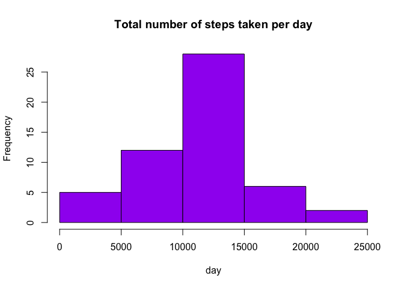
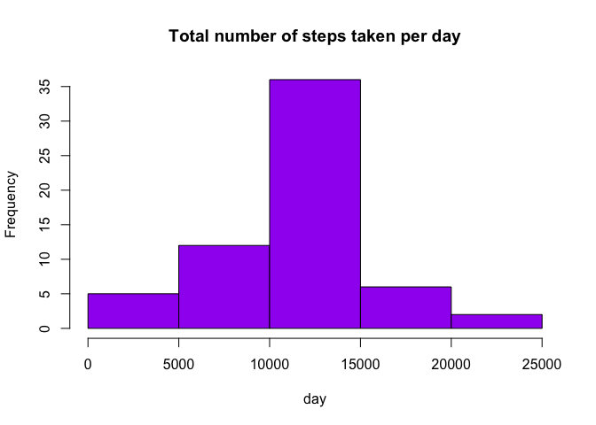

# Reproducible Research: Peer Assessment 1


## Loading and preprocessing the data

```r
activityData <- read.csv("activity.csv", colClasses = c("numeric", "character", 
    "numeric"))
head(activityData)
```

```
##   steps       date interval
## 1    NA 2012-10-01        0
## 2    NA 2012-10-01        5
## 3    NA 2012-10-01       10
## 4    NA 2012-10-01       15
## 5    NA 2012-10-01       20
## 6    NA 2012-10-01       25
```


```r
names(activityData)
```

```
## [1] "steps"    "date"     "interval"
```


```r
library(lattice)
activityData$date <- as.Date(activityData$date, "%Y-%m-%d")
```
## What is mean total number of steps taken per day?
##### Using aggregate function and generating Histogram

```r
totalSteps <- aggregate(steps ~ date, data = activityData, sum, na.rm = TRUE)
hist(totalSteps$steps, main = "Total number of steps taken per day", xlab = "day", col = "purple")
```

 

##### Mean of total steps taken

```r
mean(totalSteps$steps)
```

```
## [1] 10766.19
```
##### Median of total steps taken

```r
median(totalSteps$steps)
```

```
## [1] 10765
```
## What is the average daily activity pattern?

##### Average number of steps taken, averaged across all days

```r
time_series <- tapply(activityData$steps, activityData$interval, mean, na.rm = TRUE)
head(time_series)
```

```
##         0         5        10        15        20        25 
## 1.7169811 0.3396226 0.1320755 0.1509434 0.0754717 2.0943396
```
##### The Plot is

```r
plot(row.names(time_series), time_series, type = "l", xlab = "5-min interval", 
    ylab = "Average across all Days", main = "Average number of steps taken", 
    col = "black")
```

 

##### Which 5-minute interval, on average across all the days in the dataset, contains the maximum number of steps?

```r
max_interval <- which.max(time_series)
names(max_interval)
```

```
## [1] "835"
```
## Imputing missing values
##### Total number of NAs in activity data

```r
sum(is.na(activityData))
```

```
## [1] 2304
```

##### Filling all NAs in data set with mean in 5-min interval and creeating new data set


```r
averageSteps <- aggregate(steps ~ interval, data = activityData, FUN = mean)
fillData <- numeric()
for (i in 1:nrow(activityData))
{
    observation <- activityData[i, ]
    if (is.na(observation$steps)) {
        steps <- subset(averageSteps, interval == observation$interval)$steps
    } 
    else {
        steps <- observation$steps
    }
    fillData <- c(fillData, steps)
}
newActivity <- activityData
newActivity$steps <- fillData
```

##### Average number of steps taken, averaged across all days on New data set and histogram

```r
totalStepsNew <- aggregate(steps ~ date, data = newActivity, sum, na.rm = TRUE)
hist(totalStepsNew$steps, main = "Total number of steps taken per day", xlab = "day", col = "purple")
```

 
##### Mean of total steps taken on new data set

```r
mean(totalStepsNew$steps)
```

```
## [1] 10766.19
```
##### Median of total steps taken on new data set

```r
median(totalStepsNew$steps)
```

```
## [1] 10766.19
```
##### After filling NAs, and running same tests on new data, observing median value changing while mean remains same.
## Are there differences in activity patterns between weekdays and weekends?
#####Create a new factor variable in the dataset with two levels -- "weekday" and "weekend" indicating whether a given date is a weekday or weekend day


```r
day <- weekdays(activityData$date)
dayTracker <- vector()
for (i in 1:nrow(activityData)) {
    if ((day[i] == "Saturday") | (day[i] == "Sunday")) {
        dayTracker[i] <- "Weekend"
    } else {
        dayTracker[i] <- "Weekday"
    }
}
activityData$dayTracker <- dayTracker
activityData$dayTracker <- factor(activityData$dayTracker)

stepsByDay <- aggregate(steps ~ interval + dayTracker, data = activityData, mean)
names(stepsByDay) <- c("interval", "dayTracker", "steps")
```

##### The panel plot containing a time series plot (i.e. type = "l") of the 5-minute interval (x-axis) and the average number of steps taken, averaged across all weekday days or weekend days (y-axis).


```r
xyplot(steps ~ interval | dayTracker, stepsByDay, type = "l", layout = c(1, 2), 
    xlab = "Interval", ylab = "Number of steps")
```

 

###Done assignment
